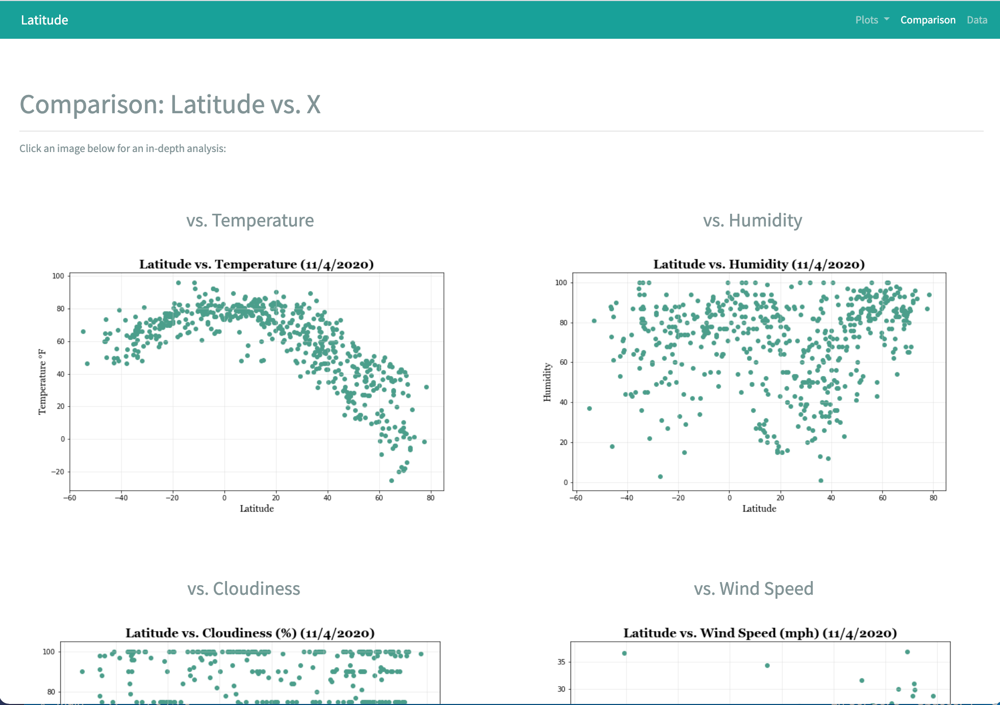

# Web_Visualization_Dashboard

## https://alexarnold630.github.io/Web_Visualization_Dashboard/app/index.html

## Background
Create a visualization dashboard website of over 500 cities relative to the equator using HTML, CSS, and Bootstrap.

## Technologies Used
- HTML
- CSS
- Bootstrap

## Objective
In building this dashboard, create individual pages for each plot and a means to navigate between them. These pages will contain the visualizations and their corresponding explanations. In addition, create a landing page, a page to see a comparison of all of the plots, and another page to view the data used to build them.

## Website
The website must consist of 7 pages total, including:

- A landing page containing:
    - An explanation of the project.
    - Links to each visualizations page. There should be a sidebar containing preview images of each plot, and clicking an image should take the user to that visualization.

- Four visualization pages, each with:
    - A descriptive title and heading tag.
    - The plot/visualization itself for the selected comparison.
    - A paragraph describing the plot and its significance.

- A "Comparisons" page that:
    - Contains all of the visualizations on the same page so we can easily visually compare them.
    - Uses a Bootstrap grid for the visualizations.
    - The grid must be two visualizations across on screens medium and larger, and 1 across on extra-small and small screens.

- A "Data" page that:
    - Displays a responsive table containing the data used in the visualizations.
    - The table must be a bootstrap table component. 

## Data
Open Weather Map API: https://openweathermap.org/api

### Contact:
Alex Arnold: alexnarnold630@gmail.com  